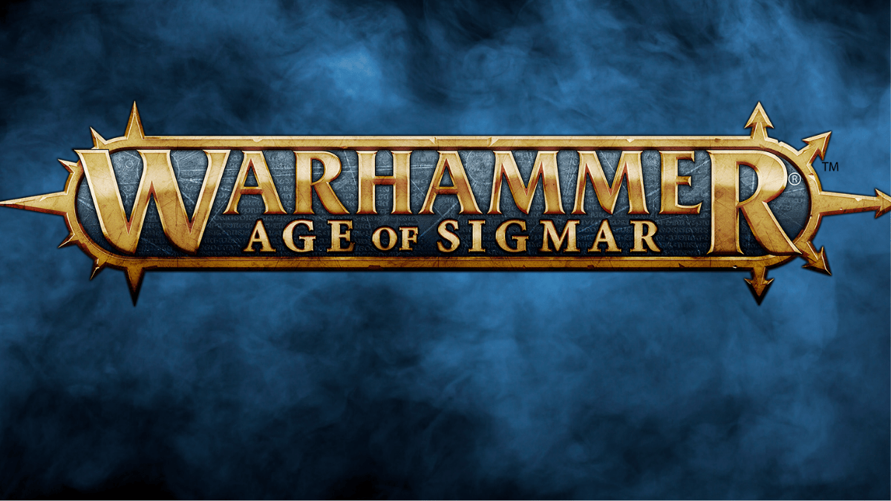

# Age of Sigmar Counter App

Esta es una aplicación de Android desarrollada en Kotlin que permite llevar la cuenta de los puntos de victoria y puntos de mando durante una partida de Warhammer. Está diseñada para usarse en modo horizontal y cuenta con una interfaz sencilla e intuitiva.

## Características

* Suma puntos de victoria de cada jugador.

* Suma y resta puntos de mando.

* Restablecimiento rápido de los contadores.

* Animaciones en los botones para una mejor experiencia visual.

* Modo pantalla completa para evitar distracciones.

## Capturas de pantalla

## Instalación

1. Clona este repositorio:

 git clone https://github.com/tu-usuario/nombre-del-repositorio.git

2. Abre el proyecto en Android Studio.

3. Compila y ejecuta la aplicación en un dispositivo o emulador.
## Uso

1. Inicia la aplicación.

2. Usa los botones para aumentar o disminuir los puntos de cada jugador.

3. Restablece los contadores con los botones de reset si es necesario.
## Tecnologías utilizadas

* Kotlin: Lenguaje principal de desarrollo.

* Android Jetpack ViewBinding: Para manejar las vistas de manera eficiente.

* Android Studio: Entorno de desarrollo.

## Contribución
Si deseas contribuir a este proyecto:

1. Haz un fork del repositorio.

2. Crea una nueva rama con tu funcionalidad (git checkout -b nueva-funcionalidad).

3. Realiza tus cambios y haz commit (git commit -m 'Añadir nueva funcionalidad').

4. Sube los cambios a tu fork (git push origin nueva-funcionalidad).

5. Abre un Pull Request en este repositorio.

## Autor

Desarrollado por LizanDev.

## Licencia

Este proyecto está bajo la licencia MIT. Consulta el archivo LICENSE para más detalles.
