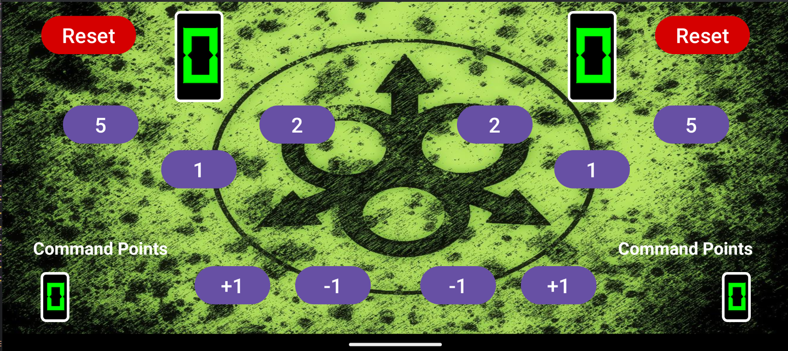

# Age of Sigmar Counter App

Una aplicación simple y eficiente para llevar el seguimiento de contadores en partidas de **Age of Sigmar**. Esta herramienta está diseñada para facilitar la gestión de puntos de victoria y 
puntos de mando durante tus batallas en el mundo de Warhammer Age of Sigmar.

## Características

- **Interfaz intuitiva**: Diseño sencillo y fácil de usar para que puedas concentrarte en la partida.
- **Ajustes rápidos**: Incrementa o disminuye los valores con un solo toque.

## Capturas de pantalla

Contribución
¡Las contribuciones son bienvenidas! Si tienes alguna idea para mejorar la aplicación, sigue estos pasos:

Haz un fork del repositorio.

Crea una nueva rama (git checkout -b feature/nueva-funcionalidad).

Realiza tus cambios y haz commit (git commit -m 'Añade nueva funcionalidad').

Haz push a la rama (git push origin feature/nueva-funcionalidad).

Abre un Pull Request.

Contacto
Si tienes alguna pregunta o sugerencia, no dudes en contactarme:

Email: Lizan.codex@gmail.com

GitHub: LizanDev
